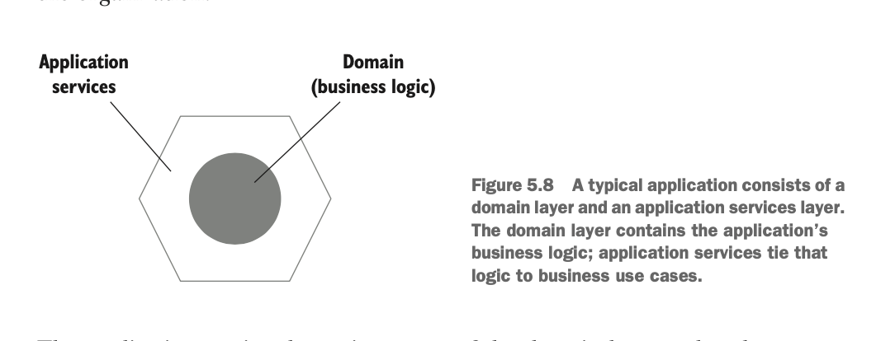
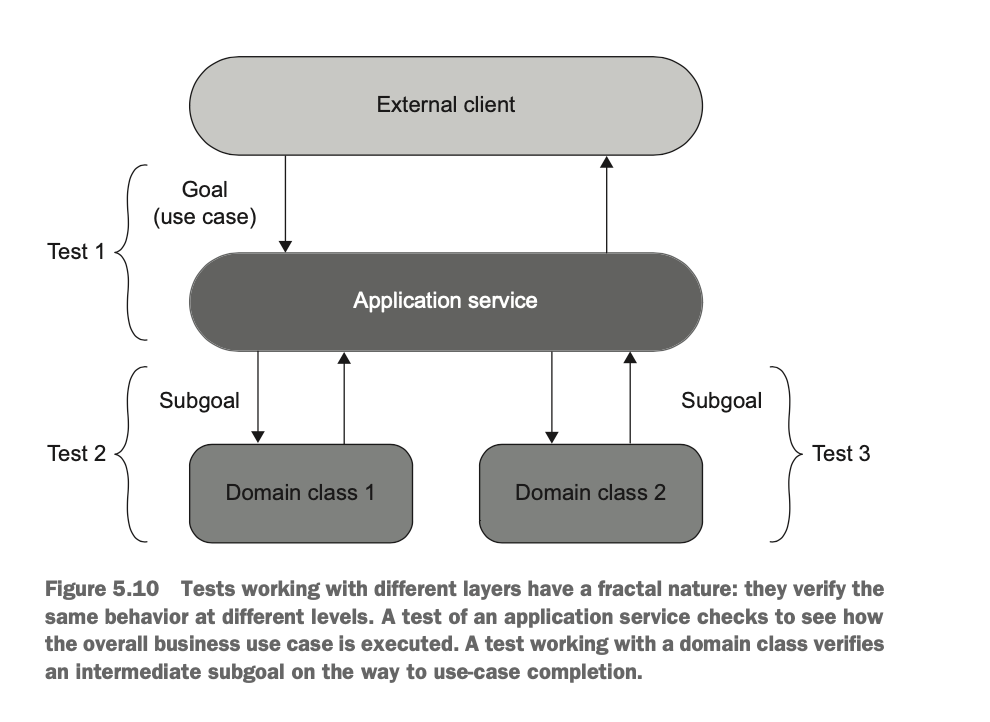

# 목과 테스트 취약성 

여기서는 목 (Mock) 이 적용되면 좋은 경우와 목을 적용했을 때 취약해지는 테스트의 경우에 대해서 알아보자. 

## 테스트 대역에서 목과 스텁이란? 

테스트 대역의 정의를 먼저 보자면 테스트 대역은 '비운영용 가짜 의존성' 을 나타내는 모든 것들을 테스트 대역이라고 부른다.

테스트 대역의 종류는 크게 목 (Mock) 과 스텁 (Stub) 이렇게 두 종류가 있다. 

여기서 목은 테스트 대상 시스템 (SUT) 와 그 협력자 사이의 상호작용을 모방하고 검사하는 테스트 대역이라면 

스텁은 상호작용을 모방하고 검사하는데 사용한다. 

목과 스텁의 가장 큰 차이는 목은 주로 외부로 나가는 상호작용을 검사하고 모방하는 반면에 스텁은 내부에 있는 상호작용을 모방한다.

외부로 나가는 상호작용은 목표를 이루고 부작용을 일으키는 상호작용이라면 내부에 있는 상호작용은 목표를 이루기 위한 상호작용을 말한다. 

그래서 목은 주로 명령 (Command) 와 관련이 있고 스텁은 조회 (Query) 와 관련이 있다. 

그리고 세부적으로는 목안에 목과 스파이가 있고 스텁 안에는 더미, 스텁, 페이크가 있는데 개념적으로 정리하면 다음과 같다. 

- 스파이: 목을 수동으로 구현한 것 .
- 목: 목 라이브러리를 써서 만든 것.
- 더미: null 과 같은 값들만 리턴한 것. (바보임)
- 스텁: 더미보다 상세한 것. 
- 페이크: 스텁과 같지만 아직 존재하지 않은 의존성임. 

우리가 목과 스텁을 만들 때는 Mock Library 를 쓰는 경우가 많은데 그래서 그런지 보편적으로는 Mock 이라는 용어을 포괄적으로 쓰기도 한다.  

**스텁을 사용할 때 주의할 점으로는 상호작용을 검사하지 마라.**

스텁은 내부 상호작용을 모방하는 용도로 사용하는데 이런 내부 상호작용은 변경될 가능성이 많다. 

즉 좋은 테스트의 요소인 리팩터링 내성이 부족하다. 

그러므로 검증할 떈 목을 이용할 때만 검증하자. 

## 식별할 수 있는 동작과 구현 세부 사항

이 책에선 *식별할 수 있는 동작* 만을 테스트로 검증하라고 한다.

먼저 책에서 정의한 *식별할 수 있는 동작과* 의 정의를 보자. 

> 클라이언트가 목표를 달성하는 연산을 노출하라. 연산은 계산을 수행하거나 부작용을 초래하거나 둘 다 하는 메소드다. 
> 
> or
> 
> 클라이언트가 목표를 달성하는 상태를 노출하라. 상태는 시스템의 현재 상태다. 

내가 이해한 식별할 수 있는 동작이란 목표를 이루는 것으로 핵심 비즈니스를 해결하는 것을 말한다. 그래서 주로 변경할 여지가 없는 부분이다.

구현 세부 사항은 목표를 이루기 위한 상호작용을 말하는 것으로 변경할 가능성이 높은 것을 말한다 라고 이해했다.

우리가 작성하는 인터페이스는 `public` 과 `private` 으로 크게 나눌 수 있다.

`public` 을 *식별할 수 있는 동작* 으로 만들면서 절대 구현의 세부 사항을 노출하지 않도록 만들어야 한다는 것이고 

오로지 `private` 에서만 *구현 세부 사항* 을 드러내길 말한다. 

바로 예시로 보자.

이 예제에서는 유저의 이름이 50 글자가 되면 안되며 그럴 경우 잘라야 한다는 어플리케이션 제약 사항이 있다. 

#### 구현 세부 사항을 드러내는 User 클래스 

```java
@Getter
@Setter 
public class User {
    public String name;
    
    public String normalizeName(String name) {
        String result = name.trim(); 
        
        if (result.length > 50) {
            return result.subString(0, 50); 
        }
        
        return result; 
    }
}

public class UserController {
    
    public void renameUser(int userId, String newName) {
        User user = getUserFromDatabase(userId); 
        
        String normalizeName = user.normalizeName(newName); 
        user.name = normalizeName; 
        
        saveUserToDatabase(user); 
    }
}
```

이 코드가 구현의 세부 사항을 드러내고 있는 이유는 최종적인 클라이언트의 목표를 보면 알 수 있다.

클라이언트의 목표는 이름을 바꾸는 것이다.  

이름이 바꼈으면 좋겠다.

normalize 된 이름을 알고 싶지 않다.

그래서 UserController 는 다음과 같이 되야한다.

```java
public class UserController {
    
    public void renameUser(int userId, String newName) {
        User user = getUserFromDatabase(userId); 
        
        user.setName(newName); 
        
        saveUserToDatabase(user); 
    }
}
```

이 setter 안에다가 normalize() 메소드가 있어야 한다.

그리고 필드가 private 이 아니라서 문제가 될 수도 있다고 생각하는데 이름 필드가 앞으로 변경될 여지가 없다면 상관없다. 

팁으로 클래스가 구현 세부 사항을 드러내고 있는지 확인하는 방법이 있다.

목표를 달성하고자 할 때 클라이언트 클래스에서 호출할 연산의 수가 1 을 넘는다면 그건 구현 세부 사항을 드러내고 있다는 뜻이다. 

**정리하자면 public 인터페이스를 사용하고자 할 땐 식별할 수 있는 동작으로만 사용하도록 하자.**

변경이 잦은 구현 세부 사항은 public 인터페이스 안에 숨기도록 하자. 

즉 캡슐화를 잘하도록 하자. 

이는 마틴 파울러가 말하는 **Tell don't ask** 와도 관련이 있다.

캡슐화를 잘 해놓지 않는다면 코드가 바뀔 때마다 테스트 코드도 같이 변경되야 할 것이다. (즉 리팩터링 내성이 없어진다.)

## 육각형 아키텍처와 (Hexagonal architecture) 식별할 수 있는 동작 



핵사고날 아키텍처는 어플리케이션 서비스와 핵심 도메인 이렇게 크게 두 가지 영역으로 나뉜다. 

어플리케이션 서비스는 외부로부터 받는 요청을 핵심 비즈니스를 담당하는 도메인에게 전달하는 역할을 하며 도메인은 도메인끼리 내부적으로 협력을 하면서 핵심 비즈니스를 처리해나간다. 

절대 도메인에게 바로 요청을 보낼 수 없다. 서비스를 통해서만 요청이 전달된다. 

서비스는 도메인이 처리한 결과를 데이터베이스에 저장하거나 그 결과를 바탕으로 또 다른 도메인에게 전달하는 역할을 한다.

이렇게 서비스와 도메인을 분리하는 이유는 다음과 같다. 

- **도메인 계층과 서비스 계층의 관심사 분리**: 도메인은 제일 중요한 비즈니스를 처리하는 역할에만 집중해야 한다. 그외의 다른 로직과 연결이 되면 안된다. 

그리고 잘 설계된 어플리케이션 서비스와 도메인은 다음과 같은 프렉탈 (fractal) 특성을 띈다. 



- 서비스는 외부 클라이언트로부터 원하는 목표 수행을 위해 요청을 전달 받는다. 

- 서비스는 이러한 목표 수행을 위해서 도메인이 요청을 처리하도록 한다. 

- 도메인은 궁극적인 목표를 위해서 하위 목표를 하나씩 처리해나간다. 

- 즉 달성하는 목표는 같지만 처리하는 수준은 다르다. 애플리케이션 서비스는 큰 목표라면 도메인은 하위 목표를 처리한다. 


이를 *식별할 수 있는 동작* 측면에서 본다면 도메인끼리 협력해서 처리하는 하위 목표는 상대적으로 *세부 구현 사항* 으로 볼 수 있고 어플리케이션 서비스를 통해서 시스템 외부 어플리케이션간의 통신은 *식별할 수 있는 동작* 으로 볼 수 있다. 

즉 도메인끼리 협력을 기반으로 하는 테스트 코드를 짠다면 테스트 코드는 취약할 것이다. (근데 하위 목표 정도라면 괜찮다고 생각이 든다. 뭐 변경되지 않는 동작이라면 괜찮은 테스트일수도.)

- 여기서는 이웃하는 클래스끼리의 협력은 클라이언트 입장에서는 아무것도 아니므로 이런 테스트는 작성하지 말자고 한다. 

도메인끼리의 협력이 아닌 애플리케이션끼리도 협력할 수 있는데 이러한 협력은 *식별할 수 있는 동작 단위* 로 이뤄지며 이때 중요한 건 **하위 호환성을 지키는 것이다.** 

- 하위 호환성을 지키는 건 서로 통신할 때 사용하는 데이터를 지우거나 변경하는 일이 있으면 안된다는 것 아닐까?

- 내가 두 어플리케이션을 같이 배포해나갈 수 있도록 배포 주기를 컨트롤할 수 있으면 하위 호환성은 신경쓰지 않아도 될 듯. 


